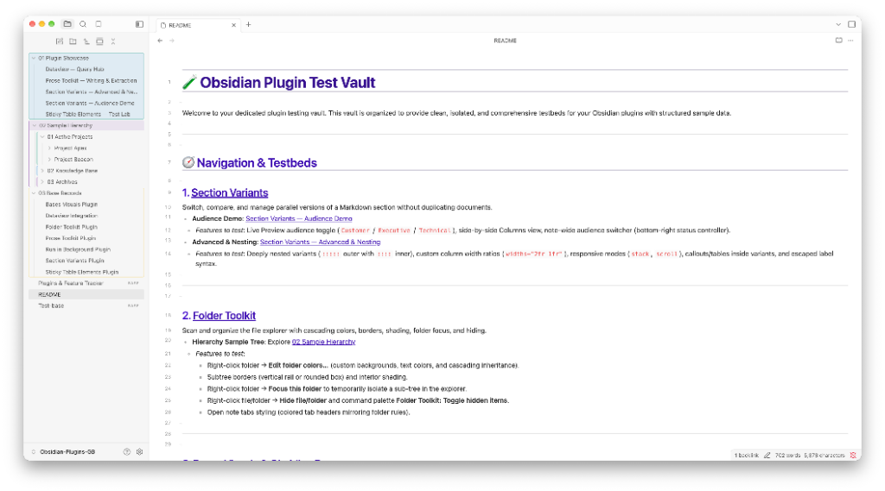

# Folder Toolkit

Folder Toolkit makes Obsidian's file explorer easier to scan and temporarily simplify. It combines independent folder and note colors, cascading folder styles, subtree borders, permanent hiding, and session-only folder focus.

## Screenshots



## Features

- Independent text and background colors for folders and notes
- Per-effect folder cascading with explicit inheritance blockers
- Rounded-box or vertical-rail borders around folder subtrees, with optional shaded interiors
- Alternating active-palette borders for direct subfolders
- Optional colored backgrounds or borders on open note tabs
- The same eight switchable palette templates as Bases Visuals, plus custom hex colors
- Permanent file and folder hiding with a searchable manager
- A temporary focused-folder view that presents any nested folder as the visible explorer root
- Segment-safe path updates when files and folders are renamed or deleted
- Multiple file-explorer panes, desktop, and mobile support
- Efficient differential explorer and tab updates that avoid rewriting unchanged DOM styles

## Usage

Right-click or long-press a file or folder and use the actions in Obsidian's plugin-action group:

- **Edit folder colors…** or **Edit file colors…** opens a background-first color editor. Cascaded backgrounds remain aligned to each indented explorer row, while folder borders and optional shading enclose their own subtree. Direct subfolders can receive alternating colors from the active palette. Draft changes preview directly in the file explorer; **Save** keeps them and **Cancel** restores the saved rule.
- **Hide file/folder** permanently removes the item from the explorer until hidden items are shown or the path is unhidden.
- **Focus this folder** temporarily hides unrelated branches. Use **Exit folder focus** from a visible folder or the command palette to restore the explorer.

Use **Folder Toolkit: Toggle hidden items** to reveal hidden paths. The settings tab contains the palette selector and a searchable manager for all appearance and hidden-path rules.

Set **Open note tabs** to **Colored background** or **Colored border** to carry each open note's effective cascaded colors into its workspace tab. Text rules color the tab title, while background rules independently color the tab surface or border.

When a file or folder is renamed or moved, saved rules follow the path and open tabs immediately resolve their appearance from the new folder hierarchy.

Folder focus lasts only for the current Obsidian session. Permanent hiding and appearance settings persist.

## Performance

Folder Toolkit updates explorer rows and open-note tabs only when their managed classes or colors actually change. Tab updates are driven by Obsidian workspace and vault events rather than observing every DOM mutation in the workspace, keeping typing and large file explorers responsive.

## Installation

### Community plugins

After approval, install **Folder Toolkit** from **Settings → Community plugins → Browse**.

### Manual installation

Copy `main.js`, `manifest.json`, and `styles.css` into:

```text
<vault>/.obsidian/plugins/folder-toolkit/
```

Reload Obsidian and enable **Folder Toolkit**.

## Privacy

Folder Toolkit works entirely offline. It makes no network requests, collects no telemetry, and never modifies note content or frontmatter. Its stored data contains only vault-relative paths and visual preferences.

## Development

```bash
npm install
npm run check
```

## License and acknowledgements

Folder Toolkit is MIT licensed. Its independently implemented feature set was inspired by the MIT-licensed File Color and File Hider community plugins.
